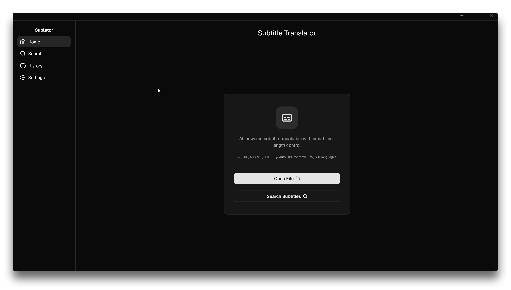
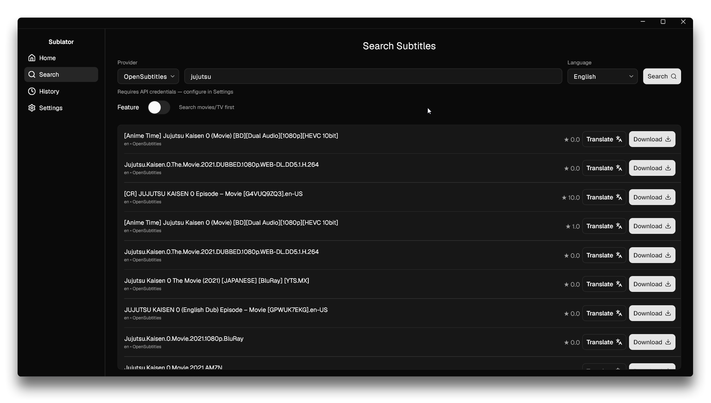
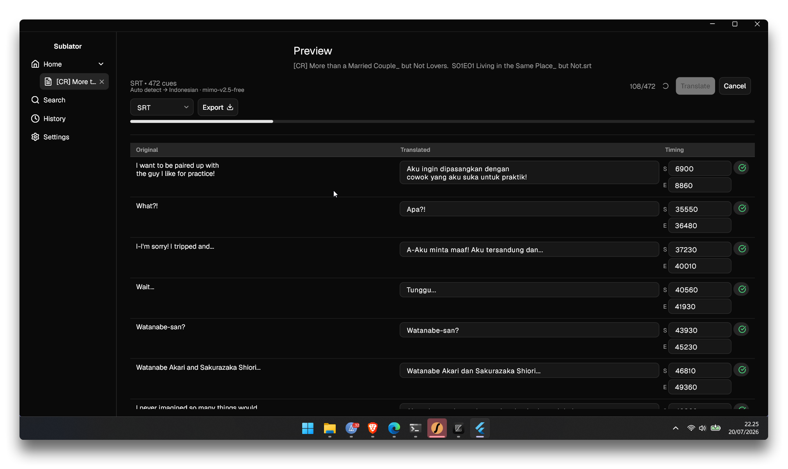
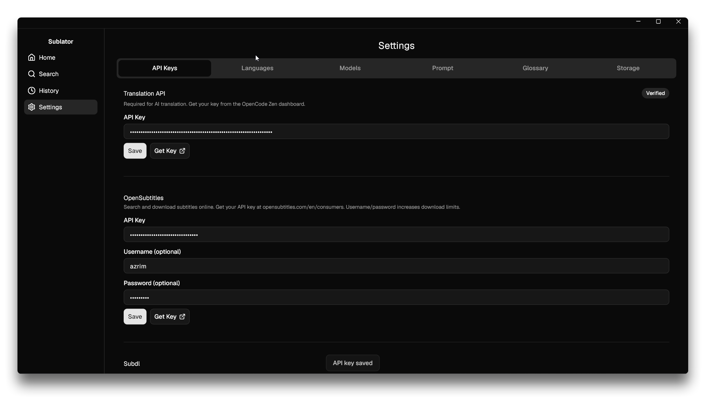
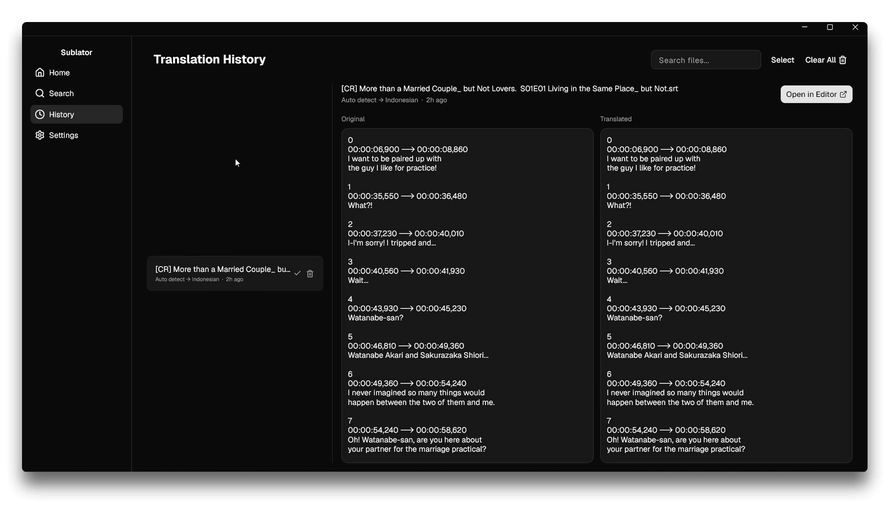

# Sublator — Subtitle Translator

AI-powered subtitle file translator for Windows desktop. Translates SRT, ASS/SSA, VTT, and MicroDVD subtitle files using OpenCode Zen AI with real-time SSE streaming.

## Features

- **4 subtitle formats**: SRT, ASS/SSA, VTT, MicroDVD (.sub)
- **AI translation**: OpenCode Zen SSE streaming with model fallback
- **Side-by-side preview**: Original text left, real-time streaming translation right
- **Inline editing**: Edit translated text and timing directly in preview
- **Glossary**: Per-chunk glossary injection — terms that must not be translated
- **Adaptive CPL**: 42 chars/line Latin, 14-16 chars CJK — never wraps to 3rd line
- **Export**: Convert between formats with CPL overflow post-processing
- **OpenSubtitles**: Search and download subtitles directly
- **Credential security**: API keys stored in Windows Credential Manager (DPAPI)

## Screenshots

| Home | Search | Preview |
|------|--------|---------|
|  |  |  |

| Settings | History |
|----------|---------|
|  |  |

## Quick Start

```bash
# Prerequisites
flutter --version  # >=3.44.0
dart --version     # >=3.12.0

# Run
flutter pub get
flutter run -d windows

# Build release
flutter build windows --release
# Output: build/windows/x64/runner/Release/subtitle_translator.exe

# Share: zip the build/windows/x64/runner/Release/ folder
```

## Project Structure

```
lib/
├── main.dart                          # Entry point, window_manager, ProviderScope, navigation shell
├── models/
│   ├── app_database.dart              # Drift DB: Settings, GlossaryEntry, SystemPrompt tables
│   ├── language.dart                  # Shared language list (kLanguages)
│   ├── subtitle_document.dart         # SubtitleDocument (format + entries)
│   ├── subtitle_entry.dart            # SubtitleEntry (id, timing, lines, translations)
│   ├── subtitle_format.dart           # SubtitleFormat enum (srt, ass, vtt, sub)
│   └── translation_chunk.dart         # TranslationChunk + status enum
├── services/
│   ├── app_database_provider.dart     # Riverpod provider for AppDatabase (NativeDatabase)
│   ├── settings_service.dart          # Settings CRUD (Drift key/value store)
│   ├── glossary_service.dart          # Glossary CRUD + JSON import/export
│   ├── system_prompt_service.dart     # System prompt management with defaults
│   ├── credential_service.dart        # flutter_secure_storage wrapper
│   ├── translation_service.dart       # SSE streaming, chunking, model fallback
│   ├── parsers/
│   │   ├── subtitle_parser.dart       # Abstract interface + decodeStream helper
│   │   ├── srt_parser.dart            # SRT parser (subtitle package)
│   │   ├── ass_parser.dart            # ASS parser (dart_ass package)
│   │   ├── vtt_parser.dart            # VTT parser (subtitle package)
│   │   ├── sub_parser.dart            # MicroDVD parser (custom regex)
│   │   └── subtitle_parser_factory.dart  # Format detection by extension
│   └── writers/
│       ├── subtitle_writer.dart       # Abstract interface
│       ├── srt_writer.dart            # SRT writer (custom)
│       ├── vtt_writer.dart            # VTT writer (custom)
│       ├── sub_writer.dart            # MicroDVD writer (custom)
│       ├── ass_writer.dart            # ASS writer (dart_ass round-trip)
│       ├── cpl_overflow.dart          # Adaptive CPL splitter
│       └── subtitle_writer_factory.dart  # Format → writer mapping
├── views/
│   ├── home_page.dart                 # File picker, drag-drop, OpenSubtitles search
│   ├── preview_page.dart              # Streaming translation + inline edit + export
│   └── settings_page.dart             # Language/model/prompt/glossary/credentials
├── widgets/
│   └── desktop_title_bar.dart         # Custom title bar (DragToMoveArea + WindowCaptionButton)
└── utils/                             # (reserved)
test/
├── fixtures/                          # Sample subtitle files for tests
├── parsers/                           # 46 parser tests
├── writers/                           # 20+ writer tests (round-trip, CPL overflow)
├── services/                          # Storage + translation service tests
└── views/                             # Widget tests (home, preview, app shell)
```

## Architecture

### State Management
- **hooks_riverpod** + **riverpod_generator** for dependency injection
- `@riverpod` annotations generate providers automatically
- `ConsumerStatefulWidget` / `HookConsumerWidget` for widget-level state
- `flutter_hooks` for local state (`useState`, `useRef`, `useEffect`)

### UI Component Vocabulary
All UI uses **ForUI** widgets exclusively (FButton, FCard, FSidebar, FResizable, FBadge, FAlert, FHeader, FDialog, FSwitch, FTooltip, FDeterminateProgress, etc.). No Material widgets remain — only Flutter layout primitives (Row, Column, Container, etc.).

### Storage
- **Drift** (NativeDatabase): Settings, GlossaryEntry, SystemPrompt tables
- **flutter_secure_storage**: API keys (Windows Credential Manager / DPAPI)
- Never store credentials in Drift

### Translation Flow
1. User loads subtitle file → parser produces `SubtitleDocument`
2. User configures settings (source/target lang, model, prompt, glossary)
3. Click "Translate" → entries chunked into 4000 UTF-8 byte groups (200 byte overlap)
4. Each chunk sent to OpenCode Zen API as SSE stream
5. Tokens parsed in real-time (`[index] text` format), updates shown in right panel
6. On completion: export with CPL overflow post-processing

### Model Fallback
- Primary: `deepseek-v4-flash-free`
- Fallback: `mimo-v2.5-free`
- Triggers: HTTP 5xx, 429, timeout (>30s), empty response, malformed JSON

## Key Dependencies

| Package | Version | Purpose |
|---------|---------|---------|
| forui | ^0.24.0 | Desktop UI framework |
| drift | ^2.34.2 | SQLite ORM with reactive streams |
| hooks_riverpod | ^3.3.2 | State management |
| flutter_secure_storage | ^9.0.0 | Credential storage |
| window_manager | ^0.5.2 | Window control |
| file_picker | ^11.0.2 | File open/save dialogs |
| desktop_drop | ^0.7.1 | Drag-and-drop |
| subtitle | ^0.2.0 | SRT/VTT parsing |
| dart_ass | ^1.2.2 | ASS parsing + round-trip |
| http | ^1.2.0 | SSE streaming |

> **Note:** Sidebar uses FSidebar with nested items. Sidebar/content split uses FResizable (user-draggable). No sidebarx dependency — removed in favor of ForUI-native components.

## Testing

```bash
flutter test                    # All 132 tests
flutter test test/parsers/      # Parser tests
flutter test test/writers/      # Writer tests
flutter test test/services/     # Service tests
flutter test test/views/        # Widget tests
```

## License

MIT
